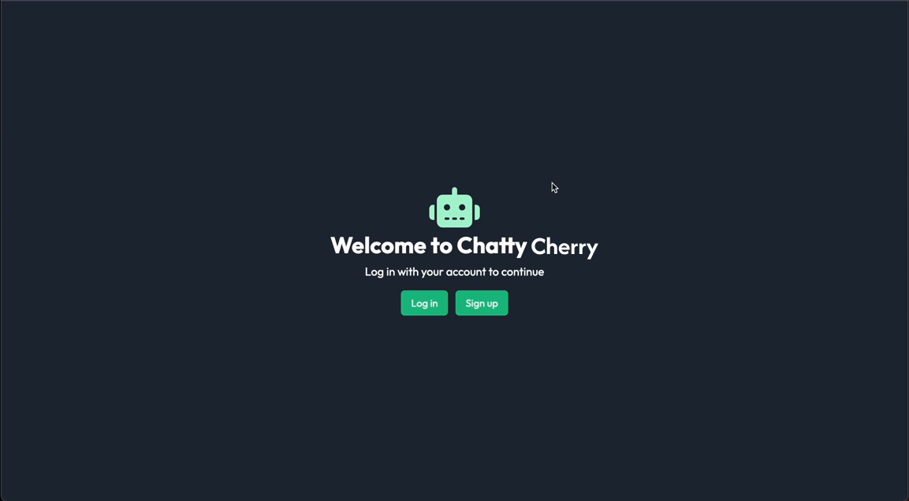
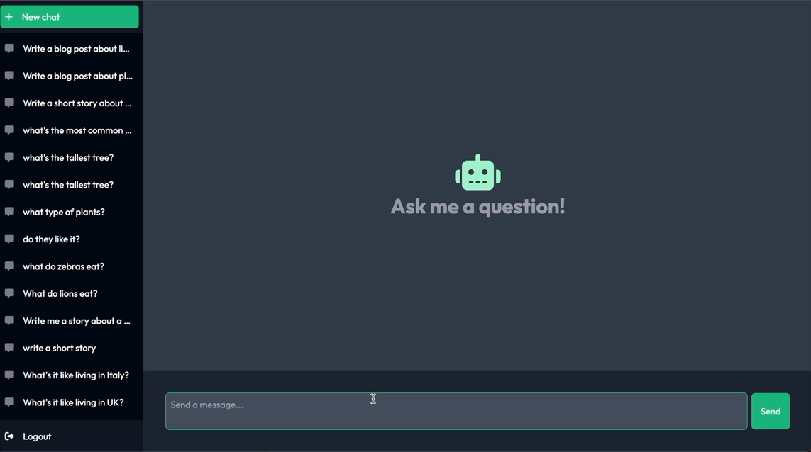
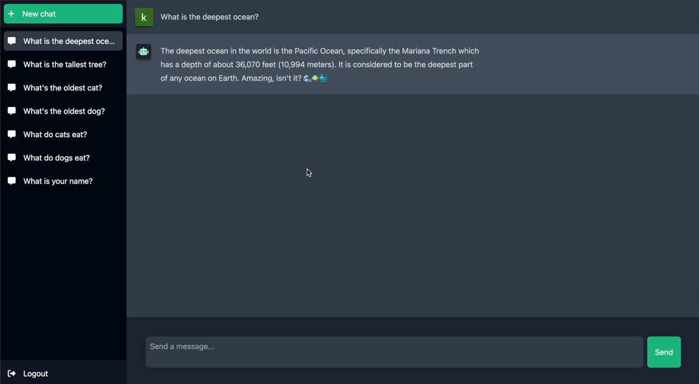

# Chatty Cherry - AI-Powered Chat Application

Chatty Cherry is a cutting-edge AI-powered chat application built with Next.js. It integrates OpenAI for intelligent responses, Auth0 for secure user authentication and MongoDB fro data storage. This project provides users with a seamless ChatGPT-like experience, allowing authenticated users to interact with AI while ensuring scalability, performance, and security.


## Screenshots






## Table of Contents

* Features
* Tech Stack
* Installation
* Configuration
* Usage
* API Endpoints
* License


## Features

- AI-Powered Conversations: Leveraging OpenAI’s language models to generate meaningful responses in real-time.

- Secure Authentication: Uses Auth0 to handle user authentication and authorization.

- Real-Time Messaging: Chat functionality allows for quick user input and response, mimicking a live chat experience.

- Typing Indicator: Shows typing status with a delay before AI responses.

- MongoDB for storing chat data, user information, and message histories.

## Tech Stack

**Frontend:** Nextjs, React, TailwindCSS

**Authentication:** Auth0 for user login and authentication

**Backend:** Node.js, OpenAI API for handling AI interactions

**State Management:** React Hooks(useState, useEffect)

**API:** Next.js API routes for server-side functionality


## Installation

To set up and run this project locally, follow the steps below:

  1.  Clone the Repository

Install my-project with npm

```bash
git clone https://github.com/BGLeee/chatty-cherry.git
cd chatty-cherry
```
2. Install Dependencies

```bash
npm install
# or
yarn install
```
3. Set Up Environment Variables

```bash
# Auth0 configuration
MONGODB_URI=<your-mongodb-connection-string>
AUTH0_SECRET=your_auth0_secret
AUTH0_BASE_URL=http://localhost:3000
AUTH0_ISSUER_BASE_URL=https://your-domain.auth0.com
AUTH0_CLIENT_ID=your_auth0_client_id
AUTH0_CLIENT_SECRET=your_auth0_client_secret

# OpenAI configuration
OPENAI_API_KEY=your_openai_api_key
```

4. Run the Development Server
```bash
npm run dev
# or
yarn dev
```

Visit http://localhost:3000 to view the app in the browser.
## Configuration
To ensure proper functionality, you must configure both Auth0 and OpenAI:

### MongoDB Integration
MongoDB is used to persist user data and chat histories. The application connects to MongoDB through the lib/mongodb.js file, which sets up the connection. Messages exchanged in the chat, along with user profiles, are stored in relevant collections.

### Auth0 Setup
1. Go to [Auth0](https://auth0.com/) and create an application.
2. Add the following URLs to the Allowed Callback URLs
* http://localhost:3000/api/auth/callback
3. Generate a Client ID, Client Secret, and Domain. These will go in your .env.local file.

### OpenAI Setup
1. Go to [OpenAI](https://platform.openai.com/) and create an API key.
2. Add the API key to your .env.local file under OPENAI_API_KEY.
## Usage/Examples
**Authentication**

* Upon accessing the application, users will be prompted to log in or sign up using Auth0.
* Authenticated users are automatically redirected to the ```/chat``` page where they can interact with the AI.
 **Chatting with AI**
* Once logged in, users can type messages in the chatbox, and the AI will respond after a brief delay to simulate typing.
* The AI's response will be generated using OpenAI’s GPT API.


## API Endpoints

**POST** ```/api/chat/sendMessage```

* Description: Sends the user's message to the OpenAI API and returns the AI's response.
* Request Body:
```
{
"role": "user"
"message": "message goes here"
}
```
* Response
```
{
"role": "assistant"
"respnse": "AI's resonse here"
}
```
## Contributing

Contributions are always welcome!
Contributions are always welcome! Whether you have suggestions for new features, bug fixes, or improvements, feel free to submit an issue or open a pull request on GitHub. Your feedback and ideas are highly appreciated.

I encourage you to customize the project, enhance its functionality, and share your improvements with the community. Let's build something amazing together! Happy coding! 🎉


